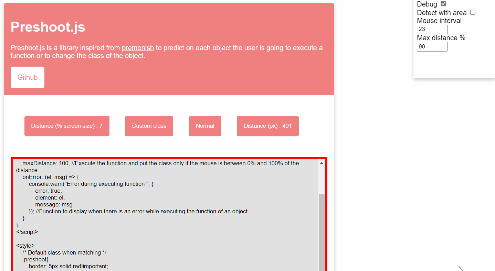

# PreshootJs v1.0

Preshoot.js is a library inspired from <a href="https://mathisonian.github.io/premonish">premonish</a> to predict on each object the user is going only with attributes to execute a function or to change the class of the object.



## Demo
- https://yoannchb-pro.github.io/Preshoot.js/
- https://yoannchb-pro.github.io/Preshoot.js/formulaire
- https://yoannchb-pro.github.io/Preshoot.js/test

## Import
```html
<!-- IN THE HEAD -->
<!-- CDN -->
<script type="text/javascript" src="https://cdn.jsdelivr.net/gh/yoannchb-pro/Preshoot.js@latest/lib/preshoot.js"></script>

<!-- NORMAL -->
<script type="text/javascript" src="./lib/preshoot.js"></script>
```

## How to use ?
Config preshoot.js
```js
window.preshootConfig = {
    debug: false, //Show a line where the cursor is going
    detectWithArea: false, //If the cursor is not going on an object preshoot.js will detect the closer object
    mouseInterval: 30, //The calcul will be make each 30 mouse move loop
    maxDistance: 100, //Execute the function and put the class only if the mouse is between 0% and 100% of the distance
    reset: true, //Reset the class of the last matched object if there is no matching anymore
    onError: (el, msg) => {
        console.warn("Error during executing function ", {
            error: true,
            element: el,
            message: msg
        }); //Function to display when there is an error while executing the function of an object
    }
}
```
Set the default class when matching
```css
 /* Default class when matching */
.preshoot{
    border: 5px solid red!important;
}
```
How to use attributes ?
```html
<!-- Watching -->
<!--
    preshoot-area allow you to observe the object and to execute a function if there is a match
    preshoot-area or preshoot-area="functionName" (note that an event is returned with dome informations)

    preshoot-area-class will change the class name (by default it will put .preshoot)
-->
<div preshoot-area></div>
<div preshoot-area="functionName"></div>
<div preshoot-area preshoot-area-class="className"></div>
<div preshoot-area="functionName" preshoot-area-class="className"></div>
```
